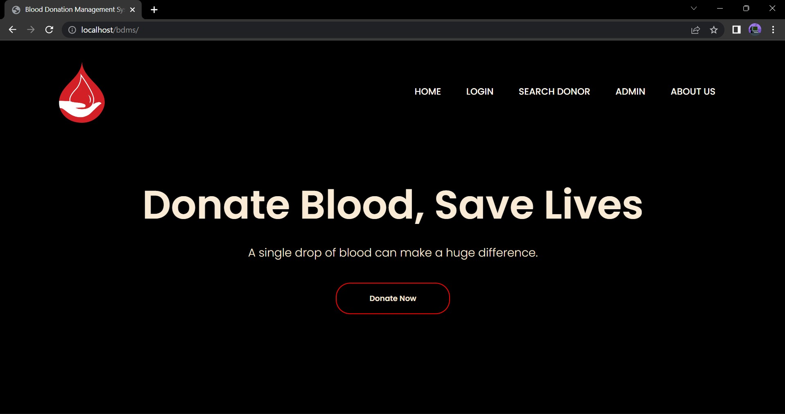
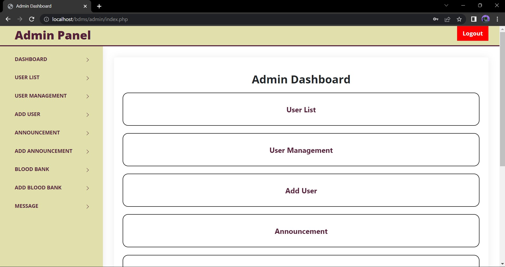
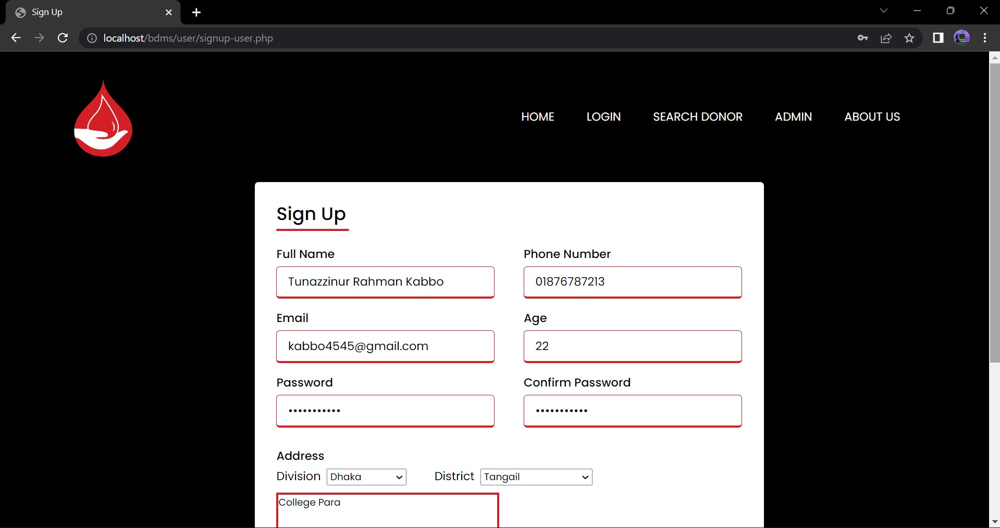

## Introduction
A Blood Donation Management System is a web-based platform to efficiently manage the process of blood donation including the collection, storage and distribution of blood. The system helps streamline the coordination between blood banks, donors, patients and hospitals by automating key processes such as donor registration, blood inventory management and tracking of blood requests. This increases blood flow and speeds up supply, improves communication with the donor community, minimizes human errors. By providing real time data on blood availability, the system ensures that hospitals, donors and patients can access the blood they need in a timely manner, ultimately contributing to life-saving medical treatments.

## Technology Stack
### Frontend :
- JavaScript for frontend interactivity and backend logic.
- HTML and CSS for structuring and styling the web pages.

### Backend :
- MySQL for database management to store all kinds of information and data.

### Development Environment & Platform :
- Visual Studio Code (VS Code)
- Chrome Developer Tools

## Key Features
- Donor Registration
- Donor Search
- Admin Panel
- Login System
- Admin Announcement
- Informative Section

## UI Implementation
### Home Page

### Admin Dashboard

### User Registration & Dashboard

## Conclusion
The ”Blood Donation Management System” initiative seeks to play a critical role in saving human lives and reducing fear in emergency circumstances. Any blood receiver can collect and store their desired blood from this web application. Besides, this web application will act as a social service application.
